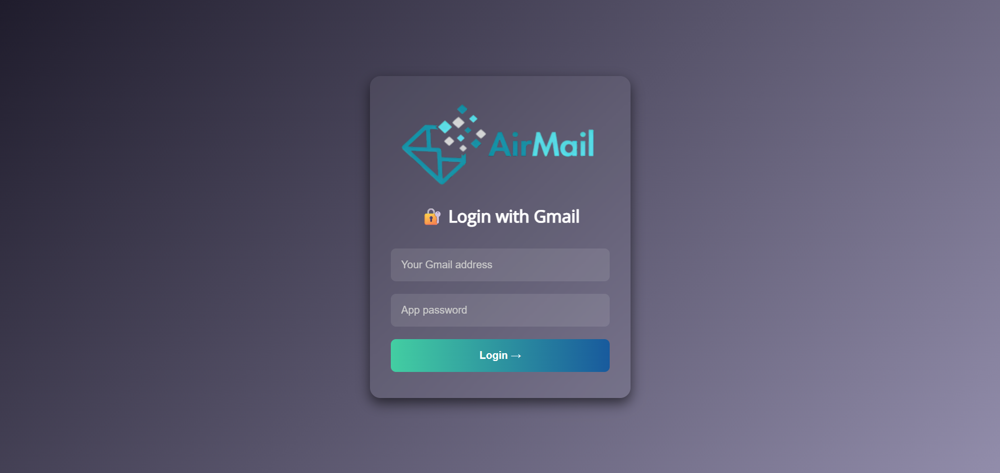
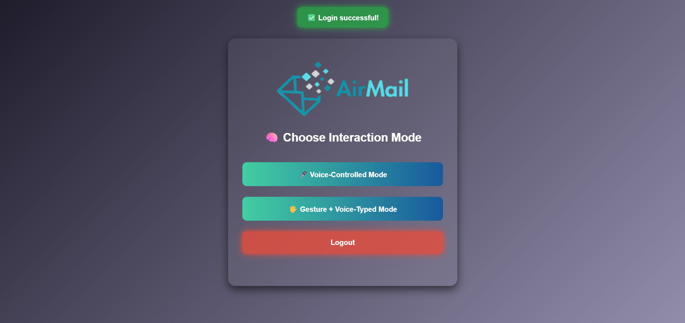
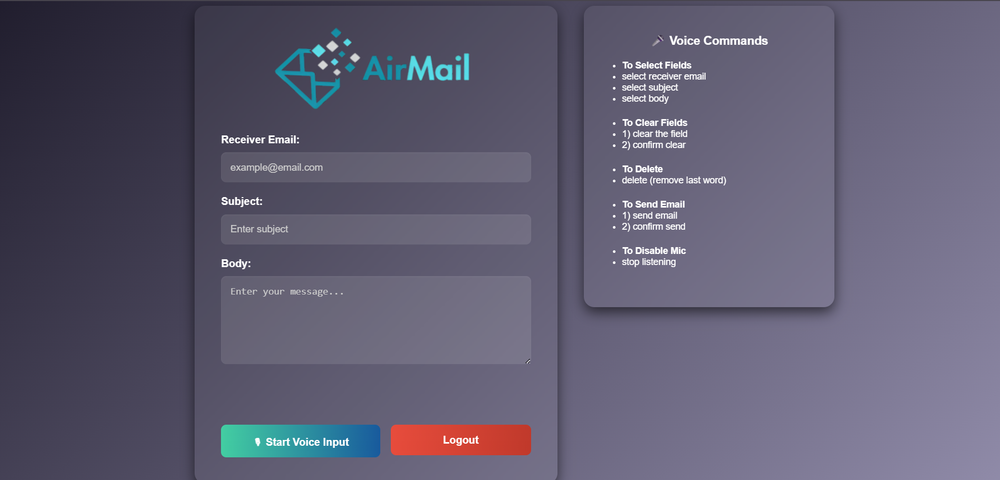
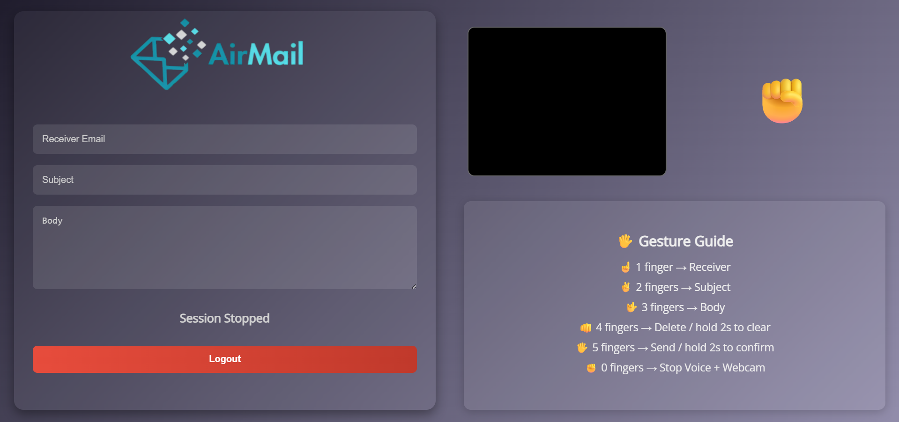

# AirMail

A voice and gesture-controlled web application for sending emails hands-free. Designed for accessibility, innovation, and ease of use, this Flask-based project supports two interaction modes:
- 🎙️ **Voice Mode** – Use voice commands to fill and send emails.
- ✋ **Gesture Mode** – Control the interface with hand gestures and voice typing using webcam and microphone.
Currently works on desktops only. Mobile compatibility will be added soon.
---

## Features

- **Voice Mode:**
  - Real-time voice-to-text using the Web Speech API.
  - Voice commands for field selection, editing, clearing, and sending.
  
- **Gesture Mode:**
  - Hand gesture recognition using MediaPipe Hands.
  - Voice typing into the selected field based on finger count.
  - Timed hold gestures for delete, clear, and send actions.

- **Authentication:**
  - Secure login with Gmail ID and app password using Flask sessions.
  
- **Email Sending:**
  - SMTP-based email delivery using Python’s `smtplib` and `ssl`.

- **UI/UX:**
  - Fully responsive layout.
  - Real-time emoji feedback and gesture timers.
  - Clean and accessible design with vanilla HTML/CSS/JS.

---

## Tech Stack

| Layer            | Tools Used                                         |
|------------------|----------------------------------------------------|
| Frontend         | HTML, CSS, JavaScript, Web Speech API              |
| Gesture Control  | MediaPipe Hands (via CDN)                          |
| Backend          | Python, Flask, smtplib, ssl                        |
| Auth & Session   | Flask Sessions                                     |
| Email Sending    | Gmail SMTP                                         |

---

## Voice Command Guide
You can find it on the main page too.         
---

---

## Gesture Guide
You can find it on the main page too.
---

## 📂 Project Structure

handsfree-email/
├── static/  
│ ├── gesture.js  
│ ├── images/  
├── templates/  
│ ├── login.html  
│ ├── mode.html  
│ ├── voice.html  
│ └── gesture.html  
├── app.py  
└── requirements.txt  

---

## 🔒 Security Notes

- This app uses Gmail's **App Passwords and not your main password** for SMTP (recommended for security).
- Credentials are stored only in Flask session and once clicked logout the session ends and no details are stored.

---

## 🛠 How to Run Locally

1. Clone this repository:
    git clone https://github.com/mc-mc111/AirMail
    cd AirMail

2. Create a Virtual Environment:
    conda create -n AirMail python=3.10.18
    conda activate AirMail

3. Install dependencies:
    pip install -r requirements.txt

4. Fill your app.secret_key in app.py (line 7):
    You can use any random string as your wish

5. Run the app:
    python app.py

## 📸 Screenshots
  
  
  
  

## 🙋‍♂️ Author
[Manicharan]  
Email: [manicharan.nulu1@gmail.com]  
GitHub: [github.com/mc-mc111]
